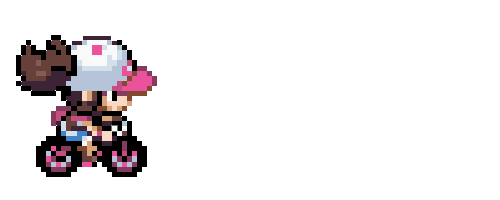

 ##  
 Oi! Eu sou a `@viamoreira`, bem-vindo ao meu `GitHub` :D !

 
   
  

   

- ✨ **Pronomes:** Ela/Dela

- 🤖 Apaixonada por robótica educacional e tecnologia.

- 💻 FIRST alumni, **Voluntária** e **Mentora** !

- 🎓 Atualmente estou me graduando em **Sistemas de Informação** .

 

## 👩🏽‍💻 Me aprimorando em: 

  <table align="center">
    <tr>
        <td align="center">
             
             Java 
        </td>
       <td align="center">
            
             C++
        </td>
        <td align="center">
            
             Javascript
        </td>
         </td>
        <td align="center">
            
             SQL
        </td>
    </tr>
</table>

##  📊 Status  

 
  

## 📲 Entre em contato comigo:

  
 

  

